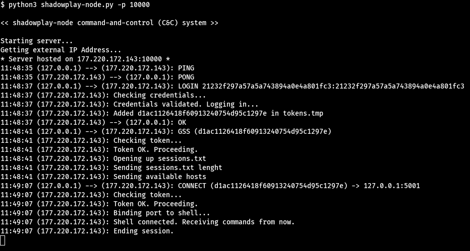

# shadowplay-node
Server for Shadowplay Command-and-Control system. Register shells, mediate connections, restrict acess.



## How does it work? 
Nodes are servers that contains addresses of collected shells. They mediate connections between those shells and the clients (shadowplay-cli), giving the users acess to any of them.

## Installation

```
git clone https://github.com/entr0pie/shadowplay-node
```

## Basic Usage:

```
python3 shadowplay-node.py --port <port-number>
```

## How can I contribute to the project? 

These topics are under development: 

- [X] Create basic connections and protocols srv-cli.
- [X] Implementing MD5 and TOKEN session methods.
- [ ] Error handling on connections and methods. 
- [ ] User input validation and sanitization.
- [ ] Handling more than one session per time.
- [ ] Use end-to-end cryptography on cli-srv communications.
- [ ] SEND INFO function (Server and Shells)
- [ ] Testing shells connection.
- [ ] Log system on the server.
- [ ] Adding multiple tokens on token.tmp
- [ ] Closing correctly connections between Shell and Node.

## License 

This project is under [GNU GPLv3.](LICENSE)